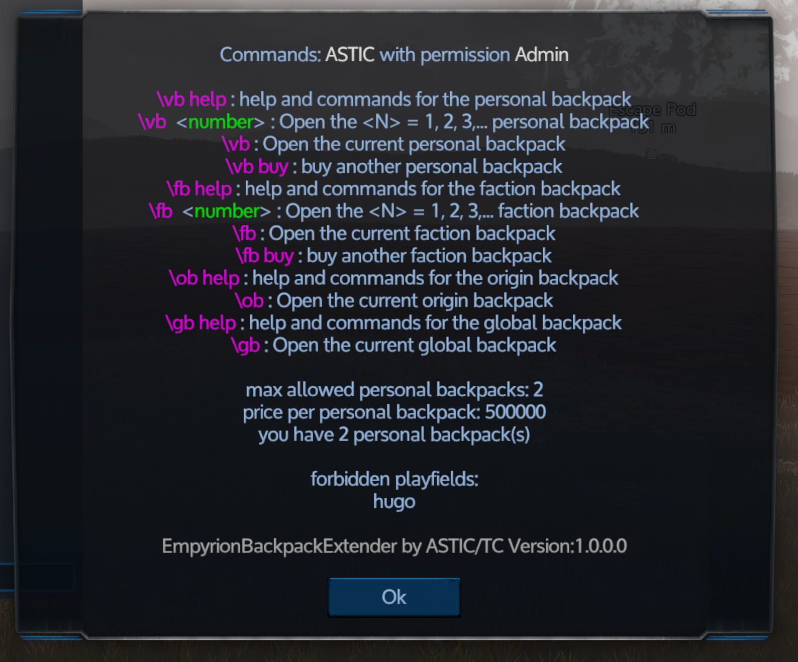
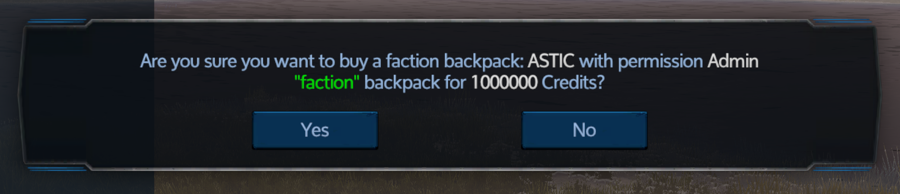
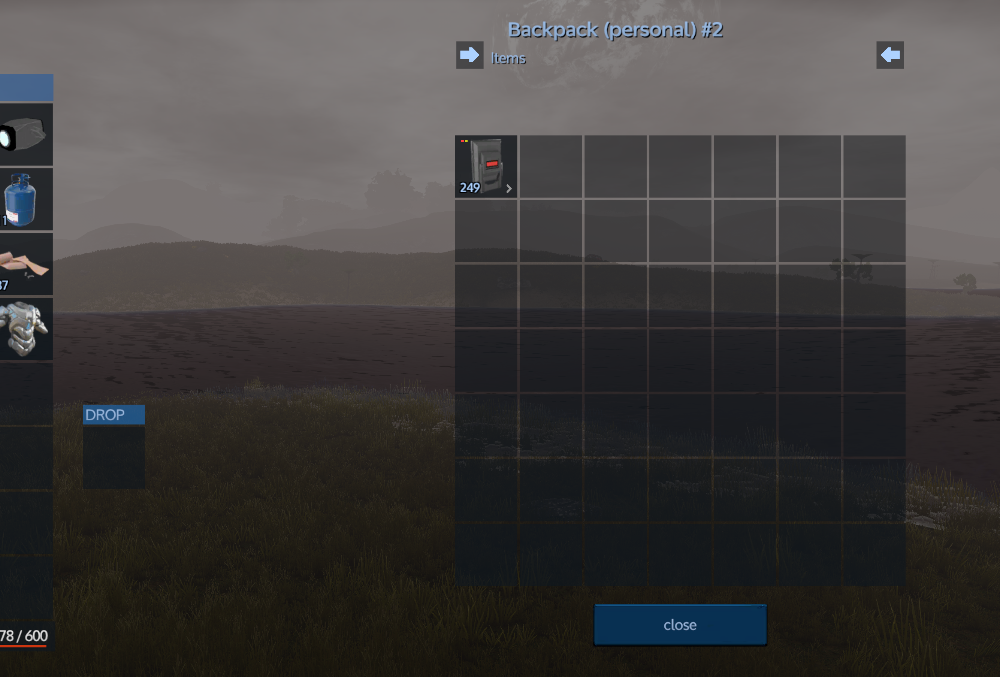

# EmpyrionBackpackExtender

## Installation
Sie können diesen Mod direkt mit dem MOD-Manager von EWA (Empyrion Web Access) laden.  
Ohne den EWA funktioniert der Mod (vermutlich) nur innerhalb des EmpyrionModHost

## Konfigurieren Sie Ihre erlaubten Backpacks
Nach der Installation und dem Start der Mods ist hier die Konfiguration abgelegt, die angepasst werden kann.
\[SaveGamePath\]\\Mods\\EmpyrionBackpackExtender\\Configuration.json

## Screenshots

## Verwendungszweck
Es gibt verschiedene Backpacks, für die alle die gleichen Kommandos gelten
* vb = persönliches Backpack
* fb = Fraktionsbackpack
* ob = Backpack für alle Mitglieder die vom selben Startplaneten kommen
* gb = globales Backpack welche für alle Spieler auf dem Server zugänglich ist

Zusammen mit einem Backslash am Anfang und im Fraktionschat sind die Kommandos also wie folgt (am Beispiel des "vb")

* \\vb help = eine Liste aller verfügbaren Kommandos und Informationen
* \\vb = öffnet das zuletzt geöffnete persönliche Backpack
* \\vb N = öffnet das N-te persönliche Backpack
* \\vb buy = kauft ein weiteres persönliches Backpack

## Konfiguration
* ChatCommandPrefix = Zeichen mit dem das Chatkommando beginnen muss
* Einstellungen für die verschiedenen Backpacktypen
  * ChatCommand = Chatkommandotext
  * MaxBackpacks = Anzahl der maximal erlaubten Backpacks
  * Price = Preis für ein Backpack
  * OpenCooldownSecTimer = Zeit in der das Backpack nicht erneut geöffnet werden kann
  * AllowSuperstack = sollen die Items zusammengefasst werden (OBACHT: hierbei gehen die Informationen zu Abnutzung und Ladungen verloren)
  * AllowedPlayfields = Liste der Playfields auf denen das Backpack erlaubt ist
  * ForbiddenPlayfields = Liste der Playfields auf denen das Backpack verboten ist
  * FilenamePattern = Speicherort und Dateiname der Backpacks

  Hinweis: Bei den Einschränkungen auf bestimmte Playfields braucht nur der jeweilig "einfacherer" Eintrag gefüllt zu werden

# EmpyrionBackpackExtender

## Installation
You can load this mod directly with the EWA (Empyrion Web Access) MOD Manager.  
Without the EWA, the mod may only works within the EmpyrionModHost

## Configure your allowed backpacks
After the installation and the start of the mods the configuration is stored here, which can be adapted.
\[SaveGamePath\]\\Mods\\EmpyrionBackpackExtender\\Configuration.json

## Screenshots

## Usage
There are different backpacks, all of which have the same commands
* vb = personal backpack
* fb = faction backpack
* ob = Backpack for all members coming from the same starting planet
* gb = global backpack accessible to all players on the server

Together with a backslash at the beginning and in the fractional table, the commands are as follows (using the example of the "vb")

* \\vb help = a list of all available commands and information
* \\vb = opens the last opened personal backpack
* \\vb N = opens the Nth Personal Backpack
* \\vb buy = buy another personal backpack

## Configuration
* ChatCommandPrefix = Character with which the chat command must start
* Settings for the different backpack types
  * ChatCommand = chat command text
  * MaxBackpacks = number of maximum allowed backpacks
  * Price = price for a backpack
  * OpenCooldownSecTimer = Time in which the backpack can not be reopened
  * AllowSuperstack = the items should be summarized (CARE: here the information on wear and charges is lost)
  * AllowedPlayfields = List of playfields where the backpack is allowed
  * ForbiddenPlayfields = List of playfields on which the backpack is prohibited
  * FilenamePattern = Location and filename of the backpacks

  Note: With the restrictions on certain Playfields only the respective "simpler" entry needs to be filled
